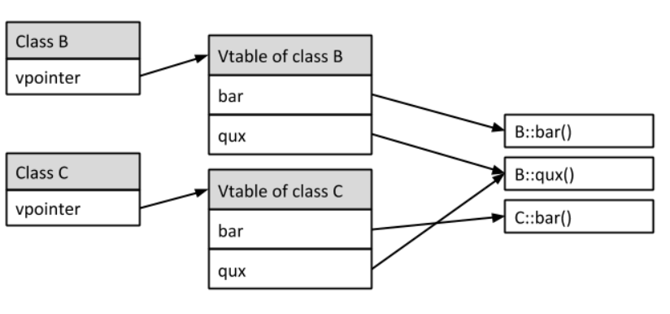

# linked-list
``` C
#define offsetof(TYPE, MEMBER) ((size_t) &((TYPE *)0)->MEMBER) 
```
# DPDK中读取64位数，用union减少操作的方法

```c
static inline uint64_t rte_rdtsc(void) { 
  union { uint64_t tsc_64; 
  struct { uint32_t lo_32; uint32_t hi_32; }; 
} tsc; 
asm volatile("rdtsc" : "=a" (tsc.lo_32), "=d" (tsc.hi_32)); return tsc.tsc_64; 
}
```

# Epoll and it's usage
- 5 种网络IO模型
    
- IO多路复用 select && poll
利用单个线程来同时监听多个FD， 并在某个FD可读、可写时得到通知，避免无效等待
select 和 poll是早期实现，无法直接获取到就绪FD列表，只能遍历
    - select  
        1） 有监听FD上限，1024个  
        2）FD分类为三个队列， readfds\writefds\excepfds
        `int select(int nfds, fd_set *readfds, fd_set *writefds,fd_set *exceptfds, struct timeval *timeout);` set均为bitmap  
        3）每次执行， 需要将三个列表拷贝至kernel， 执行完成后，将就绪set的比特位至为1， 并拷贝回userspace, 返回总共就绪的FD数目  
    - poll  
        1）poll 移除了监听FD上限  
        2）将三个队列合并为一个，进行统一管理  
        3）同样需要两次拷贝，在kernel中转为链表避免无连续内存

        ```
        struct pollfd {
        int fd; /* file descriptor */
        short events; /* requested events*/
        short revents; /* returned events */
        };
        int poll(struct pollfd *fds, nfds_t nfds, int timeout);
        ```

- 3.3 epoll模型
    epoll通过使用一层抽象，实现了对监管FD、维护就绪队列的操作，使得算法得到了进一步的效率提升
    当socket收到数据后，callback函数会给eventpoll的“就绪列表”添加socket引用

    ```C
    struct eventpoll {
    //...
    struct list_head rdllist; /* List of ready file descriptors */
    struct rb_root rbr;  /* RB-Tree root used to store monitored fd structs */
    //...
    };
    // 创建一个epoll实列，返回改epoll的fd
    int epoll_create(int size);

    // 将一个FD添加到epoll实例中监管，并设置call_back:添加对应fd至rdllist
    int epoll_ctl(int epfd, //epoll 实例FD
    int op, // 执行操作，EPOLL_CTL_ADD\EPOLL_CTL_DEL\EPOLL_CTL_MOD
    int fd, // 监听的对象fd
    struct epoll_event __user *event // 监听的事件类型：read\write\except
    )

    // 检查
    int epoll_wait(int epfd,  // epoll 实例FD
    struct epoll_event __user *events, // 用于存储就绪fd, 并返回给user_space
    int maxevents, // events数组的最大大小
    int timeout // 超时时间
    )
    ```
    解决了poll\select的问题：  
    1） 无监听上限  
    2） 不用每次来回拷贝监听列表  
    3） 直接从rdllist中O(1)拿到就绪FD， 不用遍历整个列表 

- 3.4  epoll LT\ET触发模式
    
    - 水平触发(level-trggered)
        只要文件描述符关联的读内核缓冲区非空，有数据可以读取，就一直发出可读信号进行通知，
        当文件描述符关联的内核写缓冲区不满，有空间可以写入，就一直发出可写信号进行通知
    - 边缘触发(edge-triggered)
        当文件描述符关联的读内核缓冲区由空转化为非空的时候，则发出可读信号进行通知，
        当文件描述符关联的内核写缓冲区由满转化为不满的时候，则发出可写信号进行通知
    - ET模式在很大程度上减少了epoll事件被重复触发的次数，因此效率要比LT模式高。epoll工作在ET模式的时候，必须使用非阻塞套接口，以避免由于一个文件句柄的阻塞读/阻塞写操作把处理多个文件描述符的任务饿死。
        ```C
        //水平触发
        ret = read(fd, buf, sizeof(buf));

        //边缘触发（代码不完整，仅为简单区别与水平触发方式的代码）
        while(true) {
            ret = read(fd, buf, sizeof(buf);
            if (ret == EAGAIN) break;
        }
        ```
        
- 3.5 epoll file descriptor 的问题
    进程持有一个打开FD列表， 指向kernel中的open-file-table（全局共享），再由该表指定文件INODE\OFFSET等。进程fork等可能导致epoll的监听出现epoll_ctl函数无法正常起作用的效果，根本原因在于epoll监视的是kernel中的open-file-table。

# IO_URING

 It is important to remember that I/O requests submitted to
              the kernel can complete in any order.  It is not necessary
              for the kernel to process one request after another, in
              the order you placed them.


When
              you dequeue CQEs off the CQ, you should always check which
              submitted request it corresponds to.  The most common
              method for doing so is utilizing the user_data field in
              the request, which is passed back on the completion side.

## data-structure

IOSQE_IO_DRAIN: 等待前一个IO完成后才执行下一个IO，执行Fsync

IOSQE_IO_LINK: Continue until set do this sqe IFF previous succeed


IORING_SETUP_IOPOLL: use a kworker to poll submission queue

io_uring_register: reduce get_user_pages put_pages

io_uring_enter

io_uring_setup

# Bloom filter

- problem: false positive

pseudocode code

bloom_filter:   an N bit array, for our filter
                inititialize as: 0 0 0 ....  0
                            bit: 0 1 2 .... N-1

Stream(m): data stream to be verify, each element is a type T, we have m element
Hash(k): hash function set. we have k different hash functions, turning a type T into integer

- Algo process:

1) insert

for elem_i in Stream<T>:
    for i in Hash(k):
        x = Hash_i(elem_i)
        bloom_filter[x] = 1

2) lookup

input: data_i
for i in Hash(k):
    x = Hash_i(data_i)
    if bloom_filter[x] != 1:
        data_i is definitly not in the set!!!
data_i maybe in the set!!!

- Analyze:

probability of false positive depends on density of 1's in the array

number of 1's is approximate(must be lower): m * k

consider a single bit of the filter, after all insert, the chance of remaining 0:
(1 - 1/n)^(m*k)  = (1 - 1/n)^(n * (m * k / n))
as n-> infi, (1 - 1/n)^n = e^-1, hince
= e^(-(m * k) / n)

Densiy of 1 = 1 - e^(-(m * k) / n)

probability of false positive =
(1 - e^(-(m * k) / n))^k

- given n, m, the best k
    k = (int) n / m * ln2

# CPP 中 #include<> 和 #include ""的区别

reference：https://gcc.gnu.org/onlinedocs/cpp/Search-Path.html
#include <>: 默认操作是只在标准库中搜索
#include "": 默认操作是现在当前文件目录下搜索， 然后再在标准库中搜索
使用gcc编译时， 可以使用 -I 参数增加搜索地址
查看当前的默认搜索地址， 使用命令
`cpp -v /dev/null -o /dev/null`
# 查看修改 默认 include 路径

- 查看默认路径
#gcc
`gcc -print-prog-name=cc1plus` -v
 
#g++
`g++ -print-prog-name=cc1plus` -v

- 查找顺序
  - 编译时手动指定查找顺序 -I  
    g++ -c ttcp_blocking.c -I /home/zhaozheng/code/chensuo/code/muduo-master/
  - 查找环境变量  
    #gcc
    export C_INCLUDE_PATH=XXXX:$C_INCLUDE_PATH
    #g++
    export CPLUS_INCLUDE_PATH=XXX:$CPLUS_INCLUDE_PATH
  -  系统默认标准库目录 (如果使用 include <>, 则只会搜索这里)

# ldd 的输出

用于显示链接文件的动态库位置
``` bash 
ldd `which ls`
        linux-vdso.so.1 (0x00007fffd7cf7000)
        libselinux.so.1 => /lib/x86_64-linux-gnu/libselinux.so.1 (0x00007fbc41220000)
        libc.so.6 => /lib/x86_64-linux-gnu/libc.so.6 (0x00007fbc40e20000)
        libpcre.so.3 => /lib/x86_64-linux-gnu/libpcre.so.3 (0x00007fbc40ba0000)
        libdl.so.2 => /lib/x86_64-linux-gnu/libdl.so.2 (0x00007fbc40990000)
        /lib64/ld-linux-x86-64.so.2 (0x00007fbc41800000)
        libpthread.so.0 => /lib/x86_64-linux-gnu/libpthread.so.0 (0x00007fbc40770000)
```

输出中，  =>  代表着动态库的位置

特别的，
- vdso : 用户态调用内核内容
- /lib64/ld-linux-x86-64.so.2： 链接器，运行时搜索链接路径寻找其它库，本身则是硬编码了位置


# placement new

new operator/delete operator就是new和delete操作符，而operator new/operator delete是函数

- new operator 调用operator new分配足够的空间，并调用相关对象的构造函数， 不可重载
    
- operator new 只分配所要求的空间，不调用相关对象的构造函数。可以被重载，重载时，返回类型必须声明为void* 且第一个参数类型必须为表达要求分配空间的大小（字节），类型为size_t
    
- placement new 是重载operator new 的一个标准、全局的版本，它不能够被自定义的版本代替，结果是允许用户把一个对象放到一个特定的地方，达到调用构造函数的效果。
    
    ```c
    char* buf = new char[sizeof(X)]; // new operator 创建buf
    X *px = new(buf) X;  
    px->~X(); // placement new创建的不能直接delete，而是调用其析构函数，此时即可复用该buf
    delete []buf; // 用 delete operator 删除  buf
    ```
    
#  hugepages
https://www.hudsonrivertrading.com/hrtbeat/low-latency-optimization-part-1/  
https://docs.kernel.org/admin-guide/kernel-per-CPU-kthreads.html  
https://access.redhat.com/documentation/en-us/red_hat_enterprise_linux_for_real_time/8/html-single/optimizing_rhel_8_for_real_time_for_low_latency_operation/index#proc_reducing-cpu-performance-spikes_optimizing-RHEL8-for-real-time-for-low-latency-operation  
prons:
- 1.  TLB caches memory entries and it's a fixed number. the bigger size your pages are, the bigger chance TLB hit.
- 2.  Bigger pagesizes make smaller number of pages, using less memory to store pages and it has simpler structure than normal pages. So even TLB miss, it's faster to lookup in page tables.

Usage of hugepages:
1. Transparent hugepage:operating system will replace the physical backing of processes with huge pages on its own when it deems it possible/necessary; two modes: 
   a. always: OS take control
   b. madvise: program want to use hugepage should explicitly do system-call

2. Using pseudo file-system hugetlbfs: hugetlbfs uses a specific pool of huge pages

# RAII : Resource Acquisition Is Initialization 
binds the life cycle of a resource that must be acquired before use (allocated heap memory, thread of execution, open socket, open file, locked mutex, disk space, database connection—anything that exists in limited supply) to the lifetime of an object
1. 将指针封装到类对象中，构造函数获取资源，并创建类实例，可以抛出异常；析构函数释放资源
2. 总是使用临时变量（某个函数内部，某个循环内部，栈内等）获取资源，这样资源的生命周期和临时变量的生命周期一样，当临时变量释放的时候，编译器会自动调用其析构函数，释放所持资源，而不需要手动释放。
3. 资源指：堆上内存，线程所持互斥量等，例子：
``` C++
std::mutex m;
 
void bad() 
{
    m.lock();                    // acquire the mutex
    f();                         // if f() throws an exception, the mutex is never released
    if(!everything_ok()) return; // early return, the mutex is never released
    m.unlock();                  // if bad() reaches this statement, the mutex is released
}
 
void good()
{
    std::lock_guard<std::mutex> lk(m); // RAII class: mutex acquisition is initialization
    f();                               // if f() throws an exception, the mutex is released
    if(!everything_ok()) return;       // early return, the mutex is released
}                                      // if good() returns normally, the mutex is released
```

手动实现智能指针，引入引用计数
```C++
    template<class T> class mysmart_pointer {
    private:
        T* obj;
        uint* ref_count; // 可能出现多个mysmart_pointer实例指向同一个资源，因此需要在（堆、公共内存）上维护引用计数，保证各个实例都能正确计数
    
    public: 
        mysmart_pointer(T* target); // 构造函数
        mysmart_pointer(mysmart_pointer<T>& sptr); // 构造函数，两个实例指向同一个资源
        T get_value(); 
        ~mysmart_pointer(); // 析构函数
        mysmart_pointer<T> & operator=(mysmart_pointer<T> & sptr); // 重载等于符号，意为将当前指针实例放弃，增加一个指向src的智能指针实例
    }；

    mysmart_pointer<T>::mysmart_pointer(T* target) {
        assert(target != nullptr); // 避免指针为空
        this->obj = target;
        this->ref_count = new uint;
        *(this->ref_count) = 1;
    }   

    mysmart_pointer<T>::mysmart_pointer(mysmart_pointer<T>& sptr) {
        this->obj = sptr.obj;
        this->ref_count = sptr.ref_count;
        *(this->ref_count) += 1;
    }   

    mysmart_pointer<T>::get_value() {
        return *(this->obj);
    }

    mysmart_pointer<T>::~mysmart_pointer() {
        *(this->ref_count) -= 1;
        if (*(this->ref_count) == 0) {
            delete this->obj;
            delete this->ref_count;
        }
    }

    mysmart_pointer<T>& mysmart_pointer<T>::operator=(mysmart_pointer<T>& sptr) {
        if (this == &sptr)
            return *this; // 必须要判断，否则已经释放资源
        if (*(this->ref_count) > 0) {  // == 0 是否存在？ 不应该，智能指针不允许指针悬垂
            this->~mysmart_pointer();
        }
        this->~mysmart_pointer();
        this->obj = sptr.obj;
        this->ref_count = sptr.ref_count;
        *(this->ref_count) += 1;
    }
```

# Smart pointers in C++
1. unique_ptr
   - container for a raw pointer, explicitly prevents copying of its contained pointer
   - A unique_ptr cannot be copied because its copy constructor and assignment operators are explicitly deleted
   - 创建一个新对象 ```auto u =         std::make_unique<SomeType>(constructor, parameters, here);```
   -     
        ``` C++
        std::unique_ptr<int> p1(new int(5));
        std::unique_ptr<int> p2 = p1;  // Compile error.
        std::unique_ptr<int> p3 = std::move(p1);  // Transfers ownership. p3 now owns the memory and p1 is set to nullptr.
        ```
2. shared_ptr\ weak_ptr
   -  shared_ptr maintains reference counting ownership of its contained pointer in cooperation with all copies of the shared_ptr. An object referenced by the contained raw pointer will be destroyed when and only when all copies of the shared_ptr have been destroyed
   -  A weak_ptr is a container for a raw pointer. It is created as a copy of a shared_ptr. The existence or destruction of weak_ptr copies of a shared_ptr have no effect on the shared_ptr or its other copies. After all copies of a shared_ptr have been destroyed, all weak_ptr copies become empty. 防止循环引用
   - 
        ```C++
            std::shared_ptr<int> p1 = std::make_shared<int>(5);
            std::weak_ptr<int> wp1 {p1};  // p1 owns the memory. 

            {
                std::shared_ptr<int> p2 = wp1.lock();  // Now p1 and p2 own the memory.
                // p2 is initialized from a weak pointer, so you have to check if the
                // memory still exists!
                if (p2) {
                    DoSomethingWith(p2);
                }
            }
            // p2 is destroyed. Memory is owned by p1.
        ```

# dynamic binding C++ class: virtual function
```C++
//example
class B
{
public:
  virtual void bar();
  virtual void qux();
  void qux2();
};

void B::bar()
{
  std::cout << "This is B's implementation of bar" << std::endl;
}

void B::qux2()
{
  std::cout << "This is B's implementation of qux" << std::endl;
}

class C : public B
{
public:
  void bar() override;
};

void C::bar()
{
  std::cout << "This is C's implementation of bar" << std::endl;
}

void C::qux2()
{
  std::cout << "This is C's implementation of qux" << std::endl;
}
B* b = new C();
b->bar();
b->qux2();
```
1. early binding:  
    Not using virtual function;
    在编译时确定使用哪个函数
    例如 b->qux2(), 会调用B::qux()，bad，实际类型是C
2. dynamic binding:
    例如 b->bar(), 会调用C::bar()，good，实际类型是C
    实现  
      
    a. Vtable  
    For every class that contains virtual functions, the compiler constructs a virtual table, a.k.a vtable. The vtable contains an entry for each virtual function accessible by the class and stores a pointer to its definition.

    b. Vptr  
    Every time the compiler creates a vtable for a class, it adds an extra argument to it: a pointer to the corresponding virtual table, called the vpointer.
    vpointer is just another class member added by the compiler and increases the size of every object that has a vtable by sizeof(vpointer)
# extern关键字


Use extern to declare functions or variables defined in another file when you don't have or want to use a header file.
It's best practice to declare such functions or variables in a header file and include that header file where needed.

```C++
// 申明， 在链接中被定义为弱符号 建立存储空间的声明称之为“定义”，不需要建立存储空间的声明称之为“声明”。
void int get sum();
extern void int get sum(); // 与上一条语句同样作用 申明一个可外部调用的全局函数
extern int a;  /* only this one is special!!! */
class Widget;
enum Color;
struct Swidget;

// 定义，链接中被视作强符号，重定义将导致错误！
int a;
int a = 0;
extern int a = 0;  // 与上一条语句同样作用 定义一个可外部调用的全局变量

void int get sum() {
    return；
}

extern void int get sum() {
    return；
}

class Widget {
    ...
};

enum Color{red, yellow, blue};

struct Swidget {
    ...
};

/*对变量而言，如果你想在本源文件(例如文件名A)中使用另一个源文件(例如文件名B)的变量，方法有2种：(1)在A文件中必须用extern声明在B文件中定义的变量(当然是全局变量)；(2)在A文件中添加B文件对应的头文件，当然这个头文件包含B文件中的变量声明，也即在这个头文件中必须用extern声明该变量，否则，该变量又被定义一次。

对函数\结构体而言，如果你想在本源文件(例如文件名A)中使用另一个源文件(例如文件名B)的函数，方法有2种：(1)在A文件中用extern声明在B文件中定义的函数(其实，也可省略extern，只需在A文件中出现B文件定义函数原型即可)；(2)在A文件中添加B文件对应的头文件，当然这个头文件包含B文件中的函数原型，在头文件中函数可以不用加extern。
*/
```

# lvalue && rvalue
- “l-value” refers to memory location which identifies an object, may appear as either left hand or right hand side of an assignment operator(=)
- r-value” refers to an object that has no identifiable location in memory. A r-value is an expression, that can’t have a value assigned to it, which means r-value can appear on right but not on left hand side of an assignment operator(=). 
- rvalues indicate objects eligible for move operations, while lvalues generally don’t
a parameter of rvalue reference type, because the parameter itself is an lvalue

parameters(形参) are lvalues, but the arguments（实参）with which they are initialized may be rvalues or lvalues

Function objects created through lambda expressions are known as closures

## move 移动语义
类似RUST所有权的概念，移交所有权而不进行拷贝。
```cpp
  class MyClass {
    public:
        MyClass(const std::string& s)
            : str{ s }
        {};
    // 假设已经实现了移动语义
    private:
        std::string str;
};
       std::vector<MyClass> myClasses;
       MyClass tmp{ "hello" };
       myClasses.push_back(tmp);    // 拷贝， tmp中数据拷贝给容器中元素， tmp还可以使用
       myClasses.push_back(std::move(tmp));  // 看这里，没有发生拷贝，性能提升 tmp不能正常使用


//// 右值匹配

int val{ 0 };
int&& rRef0{ getTempValue() };  // OK，引用临时对象
int&& rRef1{ val };  // Error，不能引用左值
int&& rRef2{ std::move(val) };  // OK，引用使用std::move标记的非const对象
```
### 区分拷贝与移动
移动操作执行的是对象数据的转移，那么它一定是与拷贝操作不一样的。因此，为了能够将拷贝操作与移动操作区分执行，就需要用到我们上一节的主题：左值引用与右值引用。
因此，对于容器的push_back函数来说，它一定针对拷贝操作和移动操作有不同的重载实现，而重载用到的即是左值引用与右值引用

```cpp
class vector
{
public:
    void push_back(const MyClass& value) // const MyClass& 左值引用
    {
        // 执行拷贝操作
    }
    void push_back(MyClass&& value) // MyClass&& 右值引用
    {
        // 执行移动操作
    }
};

/*
我们知道std::vector是模板类，可以用于任意类型。所以，std::vector不可能自己去实现拷贝操作或移动操作，因为它不知道自己会用在哪些类型上。因此，std::vector真正做的，是委托具体类型自己去执行拷贝操作与移动操作。
*/

class MyClass
{
public:
    // 移动构造函数
    MyClass(MyClass&& rValue) noexcept  // 关于noexcept我们稍后会介绍
        : str{ std::move(rValue.str) }  // 看这里，调用std::string类型的移动构造函数
    {}
    MyClass(const std::string& s)
        : str{ s }
    {}
private:
    std::string str;
};
```

### move具体做了些什么
```cpp
class MyClass
{
public:
MyClass()
    : val{ 998 }
    {
    name = new char[] { "Peter" };
    }
// 实现移动构造函数
MyClass(MyClass&& rValue) noexcept
    : val{ std::move(rValue.val) }  // 转移数据
    {
    rValue.val = 0;  // 清除被转移对象的数据
    name = rValue.name;  // 转移数据
    rValue.name = nullptr;  // 清除被转移对象的数据
    }
    ~MyClass()
    {
    if (nullptr != name)
    {
    delete[] name;
        name = nullptr;
    }
    }
private:
int val;
char* name;
};
MyClass A{};
MyClass B{ std::move(A) };  // 通过移动构造函数创建新对象B
```

1. 移动对象，而非拷贝
2. 将原有对象数据清除，避免产生多个对象共享数据的问题
3. C++在其文档中表明，所有标准库中的对象，当被移动之后，会处于一个“有效但未定义的状态（valid but unspecified state）”， 保证被移动对象能够被正确的析构，如这里我们的析构函数考虑了name可能是一个nullptr

### 移动构造函数和移动赋值函数的生成规则
在C++11之前，我们拥有4个特殊成员函数由编译器默认生成，即构造函数、析构函数、拷贝构造函数以及拷贝赋值运算符。从C++11开始，我们多了2个特殊成员函数，即移动构造函数和移动赋值运算符

大该生成模式如下
```cpp
 class MyClass
       {
       public:
        MyClass()
           : val{ 998 }
         {
           name = new char[] { "Peter" };
         }
        MyClass(MyClass&& rValue) noexcept
           : val{ std::move(rValue.val) }
         {
           rValue.val = 0;
           name = rValue.name;
           rValue.name = nullptr;
         }
        // 移动赋值运算符
         MyClass& operator=(MyClass&& myClass) noexcept
         {
           val = myClass.val;
           myClass.val = 0;
           name = myClass.name;
           myClass.name = nullptr;
          return *this;
         }
         ~MyClass()
         {
          if (nullptr != name)
           {
            delete[] name;
             name = nullptr;
           }
         }
       private:
        int val;
        char* name;
       };
       MyClass A{};
       MyClass B{};
       B = std::move(A);  // 使用移动赋值运算符将对象A赋值给对象B
```
- 缺省情况下，6个特殊函数编译器都会自动生成
- 在特定情况下，编译器会将移动构造函数和移动赋值运算符定义为deleted
- 在类中定义了拷贝构造函数或者拷贝赋值运算符，那么编译器就不会自动生成移动构造函数和移动赋值运算符。此时，如果调用移动语义的话，由于编译器没有自动生成，因此会转而执行拷贝操作
- 析构函数的情况和定义拷贝操作一致，如果我们在类中定义了析构函数，那么编译器也不会自动生成移动构造函数和移动赋值运算符。此时，如果调用移动语义的话，同样会转而执行拷贝操作
- 析构函数有一点值得注意，许多情况下，当一个类需要作为基类时，都需要声明一个virtual析构函数，此时需要特别留意是不是应该手动的为该类定义移动构造函数以及移动赋值运算符。此外，当子类派生时，如果子类没有实现自己的析构函数，那么将不会影响移动构造函数以及移动赋值运算符的自动生成
- 如果我们在类中定义了移动构造函数，那么编译器就不会为我们自动生成移动赋值运算符。反之，如果我们在类中定义了移动赋值运算符，那么编译器也不会为我们自动生成移动构造函数
- 定义了移动构造函数，那么编译器不会为我们自动生成移动赋值运算符，此时，移动赋值运算符的调用并不会转而执行拷贝赋值运算符，而是会产生编译错误。因为其被标记未 =delete, 吊用将导致错误

### noexcept
- “强异常保证（strong exception guarantee）”。所谓强异常保证，即当我们调用一个函数时，如果发生了异常，那么应用程序的状态能够回滚到函数调用之前
- noexcept说明符是我们对于不会抛出异常的保证，如果在执行的过程中有异常被抛出了，应用程序将会直接终止执行

### NRVO（named return value optimization，命名返回值优化）
避免过度使用std::move()
```cpp
 class MyClass
       {};
       MyClass GetTemporary()
       {
           MyClass A{};
          return A;
       }
       MyClass myClass = GetTemporary();  // 注意这里
```
在上面的例子中，GetTemporary函数会创建一个临时的MyClass对象A，接着在函数结束时返回。在没有NRVO的情况下，当执行语句MyClass myClass=GetTemporary()；时，会调用MyClass类的拷贝构造函数，通过对象A来拷贝创建myClass对象。因此，整个流程如图所示：
            
我们可以发现，在创建完myClass对象之后，对象A就被销毁了，这无疑是一种浪费。因此，编译器会启用NRVO，直接让myClass对象使用对象A。这样一来，在整个过程中，我们只有一次创建对象A时构造函数的调用开销，省去了拷贝构造函数以及析构函数的调用开销：
            

- 为什么不使用std::move? MyClass类型没有实现移动语义，当我们执行语句MyClass myClass=GetTemporary()；时，编译器没有办法调用移动构造函数来创建myClass对象。同时，遗憾的是，由于std::move(A)返回的类型是MyClass&&，与函数的返回类型MyClass不一致，因此编译器也不会使用NRVO。最终，编译器只能调用拷贝构造函数来创建myClass对象。
- 
当返回局部对象时，我们不用画蛇添足，直接返回对象即可，编译器会优先使用最佳的NRVO，在没有NRVO的情况下，会尝试执行移动构造函数，最后才是开销最大的拷贝构造函数。

# function point type
The signature void *(*)(void *) in C represents a pointer to a function that takes a single argument of type void * and returns a void *.

Here's a breakdown of what each part of the signature means:

void *: This is the return type of the function. It indicates that the function returns a pointer to an unspecified type (i.e., a generic pointer).

(*): This part of the signature indicates that we are dealing with a function pointer.

(void *): Inside the parentheses, void * represents the parameter type of the function. It indicates that the function takes a single argument, which is a pointer to an unspecified type.


# sss

```cpp

typedef union epoll_data
{
  void *ptr;
  int fd;
  uint32_t u32;
  uint64_t u64;
} epoll_data_t;

struct epoll_event
{
  uint32_t events;      /* Epoll events */
  epoll_data_t data;    /* User data variable */
} 

```


GETITIMER(2)                                                        Linux Programmer's Manual                                                        GETITIMER(2)

NAME
       getitimer, setitimer - get or set value of an interval timer

SYNOPSIS
       #include <sys/time.h>

       int getitimer(int which, struct itimerval *curr_value);
       int setitimer(int which, const struct itimerval *new_value,
                     struct itimerval *old_value);

DESCRIPTION
       These  system  calls  provide  access  to  interval timers, that is, timers that initially expire at some point in the future, and (optionally) at regular
       intervals after that.  When a timer expires, a signal is generated for the calling process, and the timer is reset  to  the  specified  interval  (if  the
       interval is nonzero).


If either field in new_value.it_value is nonzero, then the timer is armed to initially expire at the  speci‐
       fied time.  If both fields in new_value.it_value are zero, then the timer is disarmed.

       The new_value.it_interval field specifies the new interval for the timer; if both of its subfields are zero,
       the timer is single-shot.

# epoll edge level
```C
// Level-Triggered Mode (LT)
// In level-triggered (LT) mode, epoll will keep notifying you as long as a file descriptor remains in a readable or writable state. For example:

// If a file descriptor (FD) is ready to read, epoll keeps informing you each time you call epoll_wait, as long as the FD has data to be read.
// If an FD is writable, epoll will keep notifying you as long as the FD remains writable (until it is blocked or no more space in the buffer).
// Blocking I/O in Level-Triggered Mode
// If you are using blocking I/O in LT mode:

// The read or write operation could block, but epoll will continue notifying you that this FD is ready in subsequent calls to epoll_wait as long as the state persists. So, the application will eventually continue processing once the blocking operation completes or more data arrives.
// However, relying on blocking I/O in level-triggered mode is not ideal, as you may end up stalling other parts of your program while waiting for I/O.
// Edge-Triggered Mode (ET)
// In edge-triggered (ET) mode, the behavior changes fundamentally:

// epoll notifies you only once when a change occurs on a file descriptor (e.g., it becomes readable or writable). After that, it assumes you have handled everything until the state changes again (e.g., more data arrives or buffer space becomes available).
// This means if you don't drain all the data (or fill the buffer if writing) during that notification, epoll won't notify you again until the state changes again.
// Blocking I/O in Edge-Triggered Mode
// Now, let's explore why blocking I/O in ET mode is problematic:

// Single Notification: When you receive an event in ET mode, you get notified only once per state change. For example:
// If a socket becomes readable, epoll sends a single notification and then expects you to read all available data. If you don’t, and the socket remains in the same state (still readable), epoll won’t notify you again until new data arrives.
// Potential Deadlock/Starvation: Suppose you try to use blocking I/O in ET mode:
// If you attempt a blocking read, and you haven’t drained all the available data, the read may block indefinitely waiting for more data to be sent by the peer.
// But because you won’t receive a new notification from epoll, your application might enter a deadlock where it’s blocked waiting for data, and epoll won’t notify you again unless a state change occurs.
// Missed Notifications: Blocking calls in ET mode risk missing new events. If your read call blocks (because it tries to read more data than available), your program won’t be able to return to the event loop to handle new notifications on other file descriptors. The same applies to write operations that may block waiting for the buffer to become available.
// Example to Illustrate the Problem
// Blocking I/O in Level-Triggered Mode (LT)

复制代码
// Hypothetical blocking read in LT mode
for (;;) {
    int n = epoll_wait(epoll_fd, events, max_events, -1);
    for (int i = 0; i < n; i++) {
        if (events[i].events & EPOLLIN) {
            char buf[1024];
            // Blocking read
            int bytes = read(events[i].data.fd, buf, sizeof(buf)); 
            // It could block here, but epoll will keep notifying us as long as there is data
        }
    }
}
// In this case, even if the read call blocks, epoll_wait will continue to notify you on subsequent calls as long as there’s data on the file descriptor.

// Blocking I/O in Edge-Triggered Mode (ET)

复制代码
// Hypothetical blocking read in ET mode
for (;;) {
    int n = epoll_wait(epoll_fd, events, max_events, -1);
    for (int i = 0; i < n; i++) {
        if (events[i].events & EPOLLIN) {
            char buf[1024];
            // Attempting a blocking read in ET mode
            int bytes = read(events[i].data.fd, buf, sizeof(buf));
            // If this read blocks, no further notifications will arrive for this FD
        }
    }
}
// In this ET example, if the read call blocks because not all data was read, you will not get notified again until a state change occurs on the file descriptor. This can leave your program waiting indefinitely.

// Summary of Key Points
// Level-Triggered Mode repeatedly informs you about the state of file descriptors, so blocking I/O can work, but it’s inefficient and not ideal due to potential stalls.
// Edge-Triggered Mode only notifies you once, so if you don’t handle everything immediately or your I/O call blocks, you won’t receive further notifications, risking deadlocks or missed events.
// Non-blocking I/O works better with both modes but is required with edge-triggered mode to prevent stalls and to handle events promptly.
// In conclusion, edge-triggered epoll needs non-blocking I/O to ensure that your application processes all available data without risking indefinite blocking. Level-triggered epoll can tolerate blocking I/O better, but even then, it’s not recommended for high-performance, responsive applications.
```

